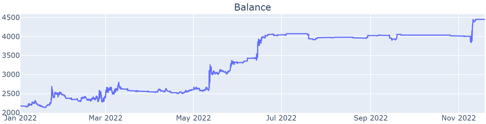

# quant-technology-reference

## 目标
建立量化开发所需掌握的知识图谱

## 价值
- 应聘量化工作
- 开发自研策略

## 如何开始
挑选感兴趣的部分阅读
- [编程语言](./programming-languages/README.md)
- [回测框架](./programming-languages/README.md)

## 贡献
PR: 贡献你的知识储备
未来将在此处列出贡献者清单

## 寻求帮助
issue: 写下任何你想说的话