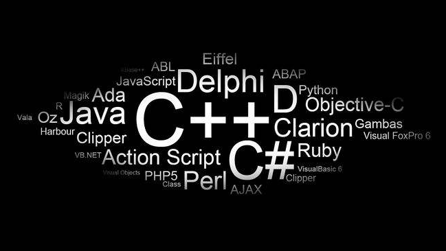

# 编程语言

## 量化开发常用编程语言

|  语言   | 作用  |  优势  | 劣势  |
|  ----  | ----  |  ----  | ----  |
|  [Python](./python/README.md)   | 策略研究、中低频实盘交易  |  简单  | 速度慢  |
|  [C/C++](./cpp/README.md)   | 高频实盘交易  |  速度快  | 复杂、开发效率低  |
